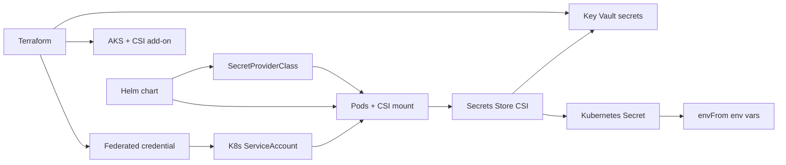

# DevOps — Terraform, Helm, and Azure

This file is the **only** README under `devops/` (Helm and Terraform are documented here, not in nested READMEs).


| Path                                                                         | Purpose                                                                                                                                         |
| ---------------------------------------------------------------------------- | ----------------------------------------------------------------------------------------------------------------------------------------------- |
| `[terraform/](terraform/)`                                                   | Azure infrastructure as code (resource group, ACR, AKS, data plane, Key Vault, workload identity; optional Front Door + WAF in `frontdoor.tf`; Azure Monitor in `monitoring.tf`) |
| `[scripts/](scripts/)`                                                       | `export-compose-env-from-terraform.sh` — `source` from repo root to set `CNIP_ACR_LOGIN_SERVER` / `CNIP_PUBLIC_APP_URL` from `terraform output` |
| `[helm/cloud-native-image-processing/](helm/cloud-native-image-processing/)` | Kubernetes chart for **API**, **image-processing worker**, **AI description worker**, and optional **frontend** (nginx + static build)          |


Root **Docker Compose** files (`docker-compose.yml`, `docker-compose.backend.yml`, `docker-compose-infra.yml`) map local containers to **Azure managed services** in production. App services use `**image:` names under your ACR login server when **`CNIP_ACR_LOGIN_SERVER`** is set in the shell (from **`terraform output`** or by sourcing [`devops/scripts/export-compose-env-from-terraform.sh`](scripts/export-compose-env-from-terraform.sh) from the repo root). Before **`docker compose push`**, run **`az acr login -n "$(terraform -chdir=devops/terraform output -raw acr_name)"`** (after `az login`); see [After `terraform apply`](#after-terraform-apply).


| Compose (local)     | Azure (typical production)                                                              |
| ------------------- | --------------------------------------------------------------------------------------- |
| Postgres container  | **Azure Database for PostgreSQL – Flexible Server**                                     |
| Redis               | **Azure Managed Redis**                                                                 |
| Azurite (blob)      | **Azure Storage Account** (blob containers: images, `eh-checkpoints`)                   |
| Event Hubs emulator | **Azure Event Hubs** (hubs: `image-processing`, `ai-description`, consumer group `cg1`) |
| —                   | **Azure AI / Computer Vision** (endpoint + key for AI worker)                           |
| —                   | **Azure Kubernetes Service (AKS)** + **Azure Container Registry (ACR)**                 |


### End-to-end secrets flow (Terraform, Key Vault, workload identity, CSI, Helm, environment variables)

This matches what the Terraform stack and Helm chart implement together.

1. **Terraform** provisions AKS (with **OIDC issuer**, **workload identity**, and **Azure Key Vault Secrets Provider** add-on), data plane resources (Postgres, Redis, Storage, Event Hubs), **Key Vault**, and a **user-assigned managed identity**. It writes application secrets into Key Vault (`azurerm_key_vault_secret`) and creates a **federated identity credential** binding that identity to the Kubernetes `ServiceAccount` in `var.kubernetes_namespace` / `var.workload_service_account_name`.
2. **Azure AD workload identity** lets that `ServiceAccount` obtain tokens for Key Vault access; **Key Vault RBAC** grants the identity **Key Vault Secrets User** on the vault.
3. **Helm** (`keyVault.enabled: true`) installs a `SecretProviderClass` (Azure provider) and an annotated `ServiceAccount`, and mounts the CSI volume on API / worker / AI worker pods. An **init container** mounts that volume first so the CSI driver can sync Key Vault via `secretObjects` into the Kubernetes `Secret` `secrets.existingSecretName` (default `cnip-app-secrets`) **before** app containers resolve `envFrom` → `secretRef` (avoids `CreateContainerConfigError: secret "cnip-app-secrets" not found`).
4. **Application containers** use `envFrom` → `secretRef` on that same secret, so each key (e.g. `ConnectionStrings__Postgres`) becomes an **environment variable** for ASP.NET Core configuration.




Install **Helm into the same namespace** as Terraform `kubernetes_namespace` (default `cnip`). After the first pod schedule, allow a short time for RBAC propagation and CSI sync before expecting the synced Secret to exist.

---

## Terraform: Azure infrastructure (`terraform/`)

IaC for: resource group, ACR, AKS, PostgreSQL, Redis, Storage, Event Hubs, **Key Vault**, secrets, user-assigned identity, federated credential, optional **Azure Front Door + WAF**, optional **Network DDoS Protection** plan, and **Azure Monitor** (Log Analytics + resource diagnostics).

### Resources created


| Resource                                                | Purpose                                                                                                      |
| ------------------------------------------------------- | ------------------------------------------------------------------------------------------------------------ |
| `azurerm_resource_group`                                | Holds all resources                                                                                          |
| `azurerm_container_registry`                            | Store API / worker / frontend images (admin enabled for bootstrap; prefer AKS + AcrPull for prod)            |
| `azurerm_kubernetes_cluster`                            | AKS (kubenet, system-assigned identity, **AcrPull** role on ACR)                                             |
| `helm_release` (ingress-nginx, optional)                | Public **LoadBalancer** + Azure DNS label for HTTP testing (`enable_public_nginx_ingress`, default **true**) |
| `azurerm_postgresql_flexible_server` + database         | Application database                                                                                         |
| `azurerm_postgresql_flexible_server_firewall_rule`      | `0.0.0.0`–`0.0.0.0` = allow Azure PaaS (includes AKS egress patterns; tighten for production)                |
| `azurerm_managed_redis`                                 | **Azure Managed Redis** for image-details cache                                                              |
| `azurerm_storage_account` + containers                  | Blobs (`images`) and Event Hub checkpoints (`eh-checkpoints`)                                                |
| `azurerm_eventhub_namespace` + hubs + consumer groups   | `image-processing`, `ai-description`, `cg1`                                                                  |
| `azurerm_eventhub_namespace_authorization_rule`         | Send/listen policy for app connection strings                                                                |
| `azurerm_key_vault` + secrets                           | Postgres, blob, Event Hubs (two KV secrets → two app env vars), Redis, Computer Vision endpoint/key          |
| `azurerm_user_assigned_identity` + federated credential | Workload identity for AKS pods → Key Vault **Secrets User**                                                  |
| `azurerm_cdn_frontdoor_*` (optional)                    | **Front Door (Premium)** + **WAF** (managed Default Rule Set) in front of the ingress hostname (`enable_azure_front_door`, requires `enable_public_nginx_ingress`) |
| `azurerm_network_ddos_protection_plan` (optional)       | **Network DDoS Protection** plan (`enable_network_ddos_protection_plan`); associate with a VNet or public IPs separately |
| `azurerm_log_analytics_workspace` + diagnostics (optional) | **Azure Monitor** backbone: Log Analytics workspace; AKS / Key Vault / ACR platform logs and metrics (`enable_azure_monitor`, default **true**) |


AKS enables **OIDC issuer**, **workload identity**, and the **Azure Key Vault Secrets Provider** add-on (`key_vault_secrets_provider`).

**Not created by this stack** (add or extend separately): the **Computer Vision Azure resource** itself (only `computer_vision_`* variables populate Key Vault), custom DNS zones, private endpoints, VNet integration for Postgres/Redis. **Front Door** and **DDoS plan** are optional via `terraform.tfvars` (see `terraform.tfvars.example`). **Application Insights** for app-level APM is not deployed here (add separately or instrument the app); this stack provides **platform** diagnostics into Log Analytics.

### Prerequisites

- [Terraform](https://developer.hashicorp.com/terraform/install) **≥ 1.5**
- [Azure CLI](https://learn.microsoft.com/cli/azure/install-azure-cli) for auth and kubeconfig merge: `az login`, `az account set --subscription <id>`
- [kubectl](https://kubernetes.io/docs/tasks/tools/), [Helm 3](https://helm.sh/docs/intro/install/), Docker and **Docker Compose V2** (`docker compose`, for building and pushing app images to ACR)

### Quick start

```bash
cd devops/terraform
cp terraform.tfvars.example terraform.tfvars
# Edit terraform.tfvars: resource_group_name, location, prefix (≥3 alphanumeric letters/digits).

terraform init
terraform plan
terraform apply
```

**Helm on Azure:** Base chart `values.yaml` sets `keyVault.enabled: false` so local `helm template` / minikube works without Terraform. **After `terraform apply` on Azure, install with Key Vault on:** use `-f values.yaml` **and** an Azure overlay (`values-azure.example.yaml` copied to `values-azure.yaml`) where `keyVault.enabled: true`, **or** pass `--set keyVault.enabled=true` together with the three `keyVault.*` values from `terraform output` (see [Helm install / upgrade](#helm-install--upgrade)).

### After `terraform apply`

Work from the **repository root** unless you `cd devops/terraform`. Use the same **Kubernetes namespace** as Terraform (`kubernetes_namespace`, default `cnip`); confirm with `terraform output -raw kubernetes_namespace_for_identity`.

1. **kubectl context** — run the command printed by `terraform output -raw aks_kube_config_command` (merges kubeconfig for the new AKS cluster).
2. **Ingress controller** — by default Terraform installs **ingress-nginx** (`**enable_public_nginx_ingress**`, default **true**) with a public Azure LB and a DNS name `**<label>.<region>.cloudapp.azure.com**`. After apply, use `**terraform -chdir=devops/terraform output -raw ingress_test_http_url**` and set CNIP Helm `**ingress.hosts**` / `**config.cors.allowedOrigins**` / `**CNIP_PUBLIC_APP_URL**` to that **origin** (same host) for a quick test over HTTP. To skip Terraform-managed ingress, set `**enable_public_nginx_ingress = false**` in `terraform.tfvars` and install a controller yourself (for example):
  ```bash
   helm repo add ingress-nginx https://kubernetes.github.io/ingress-nginx
   helm repo update
   helm install ingress-nginx ingress-nginx/ingress-nginx --namespace ingress-nginx --create-namespace
  ```
   If you use another ingress implementation, override `ingress.className` (and annotations) in your CNIP Helm values instead.
3. **ACR-tagged images (Docker Compose)** — at the **repository root**, export variables so Compose matches the registry and tag names Helm will use (see `values-azure.example.yaml`). **Do not rely on a `.env` file**; use Terraform outputs and a single manual image tag. (If a repo-root `.env` still exists, Compose may merge it—remove or rename it so it does not override your exports.)

   ```bash
   . devops/scripts/export-compose-env-from-terraform.sh
   export CNIP_IMAGE_TAG=1.0.3-cnip   # must match Helm image tags; not from Terraform
   ```

   Equivalent by hand:

   ```bash
   export CNIP_ACR_LOGIN_SERVER="$(terraform -chdir=devops/terraform output -raw acr_login_server)"
   export CNIP_PUBLIC_APP_URL="$(terraform -chdir=devops/terraform output -raw ingress_test_http_url)"
   # If ingress_test_http_url is empty (e.g. ingress disabled), use cnip_public_app_url_http_ip or your custom origin:
   # export CNIP_PUBLIC_APP_URL="$(terraform -chdir=devops/terraform output -raw cnip_public_app_url_http_ip)"
   export CNIP_IMAGE_TAG=1.0.3-cnip
   ```

   `**CNIP_PUBLIC_APP_URL**` is the **exact browser origin** for the SPA build (scheme + host, **no** trailing slash). It must match Helm `**ingress.hosts`** and `**config.cors.allowedOrigins**` (or your custom host, e.g. `https://app.example.com`).
   Authenticate Docker to the registry (requires `az login` to the subscription that owns the ACR):

   ```bash
   az acr login -n "$(terraform -chdir=devops/terraform output -raw acr_name)"
   ```

   Then build and push the four app images (Compose `image:` names are `CNIP_ACR_LOGIN_SERVER/cloud-native-image-processing-{api,worker,aiworker,frontend}:CNIP_IMAGE_TAG`):

   Backend-only build/push (no frontend): `docker compose -f docker-compose.backend.yml build api image-processing-worker ai-generation-worker` and the same `-f docker-compose.backend.yml push ...`.
4. **Pull secrets (optional)** — Terraform grants the AKS **kubelet** managed identity **AcrPull** on that ACR, so pulls from this registry usually work **without** a `docker-registry` secret. The Azure example overlay defaults to `**imagePullSecrets: []`**. If you add a pull secret name to values, create that secret (for example `acr-pull`), for example:
  ```bash
   export K8S_NAMESPACE="cnip"   # must match Terraform kubernetes_namespace
   kubectl create namespace "$K8S_NAMESPACE" --dry-run=client -o yaml | kubectl apply -f -
   kubectl create secret docker-registry acr-pull \
     --namespace "$K8S_NAMESPACE" \
     --docker-server="$ACR_HOST" \
     --docker-username="$(terraform -chdir=devops/terraform output -raw acr_admin_username)" \
     --docker-password="$(terraform -chdir=devops/terraform output -raw acr_admin_password)"
  ```
5. **Application secrets in the cluster**
  - **Recommended — Key Vault + Helm (Azure):** keep **`keyVault.enabled: true`** in your Azure values overlay (default in `values-azure.example.yaml`). Fill `tenantId`, `vaultName`, and `workloadIdentityClientId` from Terraform outputs ([details below](#azure-key-vault-with-terraform-recommended)). Do **not** create the Kubernetes secret `cnip-app-secrets` manually; the CSI driver creates it from Key Vault. If you use the AI worker, set `computer_vision_endpoint` / `computer_vision_api_key` in `terraform.tfvars` **before** `terraform apply` so Key Vault is populated.
  - **Alternative — manual secret:** only if `keyVault.enabled` is **false**: create `cnip-app-secrets` **before** `helm upgrade` using connection strings from `terraform output` ([Manual Kubernetes secret](#manual-kubernetes-secret-kubectl)).
6. **Helm install** — install into the **same namespace** as Terraform (`kubernetes_namespace`) so the federated credential matches the chart `ServiceAccount`. Use a copy of `values-azure.example.yaml` with hostname, CORS, and Key Vault block; pass the ACR host with `**--set-string acrLoginServer="$(terraform -chdir=devops/terraform output -raw acr_login_server)"`** (or set `**acrLoginServer**` in the values file). See [Helm install / upgrade](#helm-install--upgrade).
7. **DNS** — if you use the Terraform test URL (`**ingress_test_http_url**`), no extra DNS is required. Otherwise point your hostname at the ingress controller (`**terraform output -raw ingress_nginx_load_balancer_ip**` once populated, or `kubectl get svc -n ingress-nginx`) and align Ingress + `CNIP_PUBLIC_APP_URL` / CORS with that host.
8. **Wait for CSI (Key Vault path)** — after the first pods schedule, allow a short time for workload identity and the Secrets Store CSI driver to sync before expecting `cnip-app-secrets` to exist and pods to become Ready.

### View Terraform outputs safely

From `devops/terraform`, or from the repo root with `-chdir`:

```bash
terraform -chdir=devops/terraform output -json | jq 'keys'
terraform -chdir=devops/terraform output -raw acr_name
terraform -chdir=devops/terraform output -raw postgres_connection_string
terraform -chdir=devops/terraform output -raw eventhub_primary_connection_string
```

### Terraform state and secrets

- **Remote state** is not configured by default (`terraform init` uses local `terraform.tfstate`). For teams, add an **azurerm** remote backend (Azure Storage account + container) in `versions.tf` or a `backend.tf` snippet.
- **PostgreSQL password** is generated by Terraform (`random_password`) and stored in state. Protect state accordingly.
- **Do not commit** `terraform.tfvars` with embedded secrets (the repo’s `terraform.tfvars.example` does not include secrets).

### Destroy Terraform-managed resources

```bash
cd devops/terraform
terraform destroy
```

Ensure nothing outside Terraform blocks resource group deletion. AKS + Postgres can take several minutes to remove.

### Terraform provider version

The stack targets **hashicorp/azurerm ~> 4.0**. If `terraform apply` reports deprecated or renamed arguments, compare with the [azurerm provider changelog](https://github.com/hashicorp/terraform-provider-azurerm/blob/main/CHANGELOG.md) for your minor version.

---

## Kubernetes secrets

All workloads read one secret (`cnip-app-secrets` by default) with **ASP.NET Core environment variable** names (`Section__Key`).

### Azure Key Vault with Terraform (recommended)

Terraform writes connection strings and Computer Vision settings into **Key Vault** and creates a **user-assigned managed identity** plus **federated credential** for workload identity. The Helm chart can install a **SecretProviderClass** that syncs those objects into the Kubernetes secret name above (do **not** pre-create `cnip-app-secrets` in that case).

Requirements:

- AKS **Azure Key Vault Secrets Provider** add-on is enabled by Terraform (`key_vault_secrets_provider` on the cluster).
- **Helm install namespace** must equal Terraform `kubernetes_namespace` (default `cnip`) and `keyVault.serviceAccountName` must match `workload_service_account_name` (default `cnip-workload`), because the federated credential subject is `system:serviceaccount:<namespace>:<service account>`.

Inspect outputs (from `devops/terraform`, or add `-chdir=devops/terraform` from the repo root):

```bash
terraform output -raw azure_tenant_id
terraform output -raw key_vault_name
terraform output -raw workload_identity_client_id
```

In your overlay (for example a copy of `values-azure.example.yaml`), set:

```yaml
keyVault:
  enabled: true
  tenantId: "<azure_tenant_id output>"
  vaultName: "<key_vault_name output>"
  workloadIdentityClientId: "<workload_identity_client_id output>"
```

The chart creates the `ServiceAccount`, `SecretProviderClass`, CSI volume mount, pod label `azure.workload.identity/use: "true"`, and a CSI **init container** on API / workers so the synced Kubernetes `Secret` exists before `envFrom` runs. Pods still use `envFrom` → `secrets.existingSecretName`; the CSI driver populates that secret from Key Vault.

### Manual Kubernetes secret (`kubectl`)

If `keyVault.enabled` is **false**, create the secret before installing the chart. You can copy values from `terraform output -raw postgres_connection_string`, `storage_primary_connection_string`, `eventhub_primary_connection_string`, and `redis_primary_connection_string` (Event Hubs: use the **same** connection string for both hub env vars; hub names are set in the Helm ConfigMap).

```bash
export K8S_NAMESPACE="cnip"
kubectl create namespace "$K8S_NAMESPACE"

kubectl create secret generic cnip-app-secrets \
  --namespace "$K8S_NAMESPACE" \
  --from-literal=ConnectionStrings__Postgres='<postgres-connection-string>' \
  --from-literal=BlobStorage__ConnectionString='<azure-storage-connection-string>' \
  --from-literal=EventHubs__ImageProcessingConnectionString='<event-hubs-connection-string>' \
  --from-literal=EventHubs__AiDescriptionConnectionString='<event-hubs-connection-string>' \
  --from-literal=Redis__ConnectionString='<redis-connection-string-or-empty>' \
  --from-literal=ComputerVision__Endpoint='<https://your-resource.cognitiveservices.azure.com/>' \
  --from-literal=ComputerVision__ApiKey='<key-or-empty-if-not-used>'
```

For Key Vault without Terraform, use the [Secrets Store CSI driver](https://learn.microsoft.com/azure/aks/csi-secrets-store-driver) or **External Secrets** instead of long-lived static secrets in the cluster.

---

## Helm install / upgrade

From the repository root (`K8S_NAMESPACE` must match Terraform `kubernetes_namespace`, default `cnip`).

**On Azure (after `terraform apply`), always deploy with `keyVault.enabled: true`** so pods use the Key Vault and workload identity Terraform created. The Azure overlay does this; the base `values.yaml` alone leaves Key Vault off for non-Azure clusters.

Copy `[values-azure.example.yaml](helm/cloud-native-image-processing/values-azure.example.yaml)` to `values-azure.yaml` and set `**YOUR_APP_HOST`** and `**config.cors**`. For **Key Vault**, you can either put `tenantId`, `vaultName`, and `workloadIdentityClientId` in that file **or** omit them there and pass them on the `**helm upgrade`** line (later flags override values files). The example keeps `**keyVault.enabled: true`** with empty IDs so the chart fails fast unless you set the three fields **either** in a values file **or** via `**--set-string`** on the command line. Do **not** `kubectl create` `cnip-app-secrets` when Key Vault is on.

```bash
export K8S_NAMESPACE="cnip"
helm upgrade --install cnip ./devops/helm/cloud-native-image-processing \
  --namespace "$K8S_NAMESPACE" \
  --create-namespace \
  -f ./devops/helm/cloud-native-image-processing/values.yaml \
  -f ./devops/helm/cloud-native-image-processing/values-azure.yaml \
  --set-string acrLoginServer="$(terraform -chdir=devops/terraform output -raw acr_login_server)"
```

**Key Vault only via CLI** (base `values.yaml` has `keyVault.enabled: false`, so **turn Key Vault on for Azure**; values file can still hold tags, ingress, CORS; Key Vault IDs and ACR host from Terraform via `**--set-string`**):

```bash
export K8S_NAMESPACE="cnip"
helm upgrade --install cnip ./devops/helm/cloud-native-image-processing \
  --namespace "$K8S_NAMESPACE" \
  --create-namespace \
  -f ./devops/helm/cloud-native-image-processing/values.yaml \
  --set keyVault.enabled=true \
  --set-string acrLoginServer="$(terraform -chdir=devops/terraform output -raw acr_login_server)" \
  --set-string keyVault.tenantId="$(terraform -chdir=devops/terraform output -raw azure_tenant_id)" \
  --set-string keyVault.vaultName="$(terraform -chdir=devops/terraform output -raw key_vault_name)" \
  --set-string keyVault.workloadIdentityClientId="$(terraform -chdir=devops/terraform output -raw workload_identity_client_id)"
```

Use `**--set-string**` (not `--set`) for GUIDs so Helm does not parse them as floats. You can mix `**-f**` files and multiple `**--set` / `--set-string**` flags; rightmost wins for the same key.

The base chart uses **ingress-nginx** (`ingress.className: nginx`). `**imagePullSecrets`** defaults to empty in the example; add a `docker-registry` secret only if you need it. Keep `values-azure.yaml` out of git if it embeds anything you treat as sensitive.

Render manifests locally (base values only; Key Vault objects are skipped unless you enable them):

```bash
helm template cnip ./devops/helm/cloud-native-image-processing \
  -f devops/helm/cloud-native-image-processing/values.yaml
```

To render the full Azure overlay (`values-azure.example.yaml` already sets `keyVault.enabled: true`; placeholders for Terraform outputs):

```bash
helm template cnip ./devops/helm/cloud-native-image-processing \
  -f devops/helm/cloud-native-image-processing/values.yaml \
  -f devops/helm/cloud-native-image-processing/values-azure.example.yaml \
  --set-string keyVault.tenantId=00000000-0000-0000-0000-000000000000 \
  --set-string keyVault.vaultName=placeholder \
  --set-string keyVault.workloadIdentityClientId=00000000-0000-0000-0000-000000000000
```

If you render with **only** `values.yaml` and CLI, add `--set keyVault.enabled=true` alongside the `keyVault.*` `--set-string` flags (same as the [Helm install](#helm-install--upgrade) example above).

---

## DNS and TLS

- Point your public DNS **A/AAAA or CNAME** to the ingress controller’s public IP or hostname (from `kubectl get svc -n ingress-nginx` or your App Routing endpoint).
- Add TLS: create a certificate (e.g. **cert-manager** + Let’s Encrypt) and set `ingress.tls` in values.

---

## Scaling the API beyond one pod

The chart defaults to **one API replica** because `AddIdentityApiEndpoints` + Bearer tokens typically require **shared signing / Data Protection keys** when multiple instances run. Before raising `api.replicaCount`, configure persisted keys (for example **Azure Key Vault** + `AddDataProtection().PersistKeysToAzureBlobStorage` / `ProtectKeysWithAzureKeyVault`, or another shared key ring). Otherwise different pods may issue or validate tokens inconsistently.

---

## Post-deploy checks

```bash
kubectl get pods,svc,ingress -n cnip
curl -fsS "https://YOUR_HOSTNAME/health"   # or http://… if you have not enabled TLS yet
```

Register a user via `/api/auth/register` (or the SPA), upload an image, confirm worker and AI worker logs process events.

---

## Optional: Azure Front Door

Terraform can deploy **Front Door (Premium)** with a **WAF** (managed Default Rule Set) in front of the ingress hostname when **`enable_azure_front_door = true`** (requires **`enable_public_nginx_ingress = true`**). Use **`terraform output -raw cdn_frontdoor_endpoint_url`** for the public HTTPS origin; align Helm **`ingress.hosts`**, **`config.cors.allowedOrigins`**, and frontend build args with that host. **`enable_network_ddos_protection_plan`** creates a **Network DDoS Protection** plan (associate it with a VNet or protected public IPs in Azure).

The chart does not add a `cache` block on the Front Door route so edge caching stays off for dynamic API traffic. **Do not enable shared caching** for authenticated `/api/images/.../preview` routes unless you redesign around signed blob URLs (see project discussion).

---

## Files in this chart


| Path                                                   | Purpose                                                                                                                                                            |
| ------------------------------------------------------ | ------------------------------------------------------------------------------------------------------------------------------------------------------------------ |
| `devops/helm/cloud-native-image-processing/Chart.yaml` | Chart metadata                                                                                                                                                     |
| `values.yaml`                                          | Defaults                                                                                                                                                           |
| `values-azure.example.yaml`                            | Azure overlay template: **Key Vault enabled**, short image repos + `acrLoginServer` (CLI or values), ingress — copy to `values-azure.yaml` and fill from Terraform |
| `templates/*.yaml`                                     | Deployments, Services, ConfigMap, Ingress                                                                                                                          |
| `templates/keyvault-*.yaml`                            | ServiceAccount + SecretProviderClass when `keyVault.enabled`                                                                                                       |


